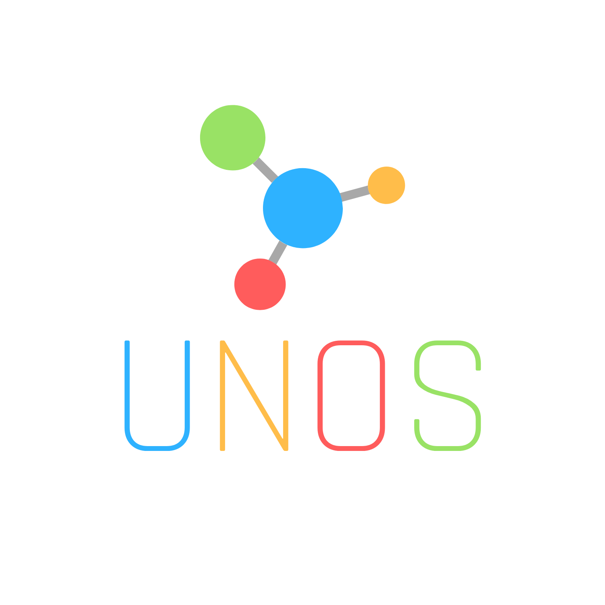

<div id="top"></div>

[![Contributors][contributors-shield]][contributors-url]
[![Forks][forks-shield]][forks-url]
[![Stargazers][stars-shield]][stars-url]
[![Issues][issues-shield]][issues-url]
[![AGPL 3.0][license-shield]][license-url]

<!-- PROJECT LOGO -->
<br />
<div align="center">
  <a href="https://github.com/MostlyWhat/Unos-Assistant">
    
  </a>

<h3 align="center">Unos Assistant Framework System</h3>

  <p align="center">
    Universal Not-Propietary Operations System or UNOS is an open-source artificial intelligence-powered system operator that is designed with expandability, transparency and adaptability in mind.
    <br />
    <a href="https://unos.mostlywhat.cf/documentation"><strong>Explore the docs »</strong></a>
    <br />
    <br />
    <a href="https://unos.mostlywhat.cf/demo">View Demo</a>
    ·
    <a href="https://github.com/MostlyWhat/Unos-Assistant/issues">Report Bug</a>
    ·
    <a href="https://github.com/MostlyWhat/Unos-Assistant/issues">Request Feature</a>
  </p>
</div>

<!-- TABLE OF CONTENTS -->
<details>
  <summary>Table of Contents</summary>
  <ol>
    <li>
      <a href="#about-the-project">About The Project</a>
      <ul>
        <li><a href="#built-with">Built With</a></li>
      </ul>
    </li>
    <li>
      <a href="#getting-started">Getting Started</a>
      <ul>
        <li><a href="#prerequisites">Prerequisites</a></li>
        <li><a href="#installation">Installation</a></li>
      </ul>
    </li>
    <li><a href="#usage">Usage</a></li>
    <li><a href="#roadmap">Roadmap</a></li>
    <li><a href="#contributing">Contributing</a></li>
    <li><a href="#license">License</a></li>
    <li><a href="#contact">Contact</a></li>
    <li><a href="#acknowledgments">Acknowledgments<a></li>
  </ol>
</details>

<!-- ABOUT THE PROJECT -->

## About The Project

[![Product Name Screen Shot][product-screenshot]](https://unos.mostlywhat.cf)

<p align="right">(<a href="#top">Back to Top</a>)</p>

### Built With

- [Python](https://www.python.org/)
- [Tensorflow](https://www.tensorflow.org/)

<p align="right">(<a href="#top">Back to Top</a>)</p>

<!-- GETTING STARTED -->

## Getting Started

To get started please follow the steps below. By installing the prerequisites and the installation steps, you will be able to use the framework.

### Prerequisites

Making sure to have install Python 3.7.5 or higher from [Python Foundation](https://www.python.org/downloads/).

### Installation

1. Read Terms and Conditions at [Legal on UNOS Website](https://unos.mostlywhat.cf/legal/terms-and-conditions)
2. Clone the repo
   ```sh
   git clone https://github.com/MostlyWhat/Unos-Assistant.git
   ```
3. Installing Dependencies using pip
   ```sh
   pip3 install -r requirements.txt
   ```
4. Start the UNOS Assistant Framework System
   ```js
   python3 unos.py
   ```

<p align="right">(<a href="#top">Back to Top</a>)</p>

<!-- USAGE EXAMPLES -->

## Usage

Ask UNOS any commands or even questions for it to attempt to answer. If you find any bugs or have any suggestions, please report them at [Issues](https:..github.com/MostlyWhat/Unos-Assistant/issues).

_For more examples, please refer to the [Documentation](https://unos.mostlywhat.cf/documentation)_

<p align="right">(<a href="#top">Back to Top</a>)</p>

<!-- CUSTOMISATIONS -->

## Customisations

You can always customise UNOS to your likings from responses to adaptors to control smart devices. Follow the documentation to learn more. You can also find more examples in the [Documentation](https://unos.mostlywhat.cf/documentation).

<p align="right">(<a href="#top">Back to Top</a>)</p>

<!-- ROADMAP -->

## Roadmap & Planned Updates

Roadmaps and Planned Updates are published on the official website of UNOS Assistant Framework System. [https://unos.mostlywhat.cf/roadmap](https://unos.mostlywhat.cf/roadmap)

See the [open issues](https://github.com/MostlyWhat/Unos-Assistant/issues) for a full list of proposed features (and known issues).

<p align="right">(<a href="#top">Back to Top</a>)</p>

<!-- CONTRIBUTING -->

## Contributing

Contributions are what make the open source community such an amazing place to learn, inspire, and create. Any contributions you make are **greatly appreciated**.

If you have a suggestion that would make this better, please fork the repo and create a pull request. You can also simply open an issue with the tag "enhancement".
Don't forget to give the project a star! Thanks again!

1. Fork the Project
2. Create your Feature Branch (`git checkout -b feature/AmazingFeature`)
3. Commit your Changes (`git commit -m 'Add some AmazingFeature'`)
4. Push to the Branch (`git push origin feature/AmazingFeature`)
5. Open a Pull Request

<p align="right">(<a href="#top">Back to Top</a>)</p>

<!-- LICENSE -->

## License

Distributed under the AGPL-3 License. See `LICENSE` for more information.

<p align="right">(<a href="#top">Back to Top</a>)</p>

<!-- CONTACT -->

## Contact

Your Name - [@mostlywhat](https://twitter.com/mostlywhat) - admin@mostlywhat.cf

Project Link: [https://github.com/MostlyWhat/Unos-Assistant](https://github.com/MostlyWhat/Unos-Assistant)

<p align="right">(<a href="#top">Back to Top</a>)</p>

<!-- ACKNOWLEDGMENTS -->

## Open-Source Technologies Used

To see the list of the open-source technologies used by the UNOS-Assistant Framework project please refer to the [Open Source Technologies](https://unos.mostlywhat.cf/legal/open-source)

<p align="right">(<a href="#top">Back to Top</a>)</p>

<!-- MARKDOWN LINKS & IMAGES -->
<!-- https://www.markdownguide.org/basic-syntax/#reference-style-links -->

[contributors-shield]: https://img.shields.io/github/contributors/MostlyWhat/Unos-Assistant.svg?style=for-the-badge
[contributors-url]: https://github.com/MostlyWhat/Unos-Assistant/graphs/contributors
[forks-shield]: https://img.shields.io/github/forks/MostlyWhat/Unos-Assistant.svg?style=for-the-badge
[forks-url]: https://github.com/MostlyWhat/Unos-Assistant/network/members
[stars-shield]: https://img.shields.io/github/stars/MostlyWhat/Unos-Assistant.svg?style=for-the-badge
[stars-url]: https://github.com/MostlyWhat/Unos-Assistant/stargazers
[issues-shield]: https://img.shields.io/github/issues/MostlyWhat/Unos-Assistant.svg?style=for-the-badge
[issues-url]: https://github.com/MostlyWhat/Unos-Assistant/issues
[license-shield]: https://img.shields.io/github/license/MostlyWhat/Unos-Assistant.svg?style=for-the-badge
[license-url]: https://github.com/MostlyWhat/Unos-Assistant/blob/master/LICENSE.txt
[product-screenshot]: Images/demo.png
